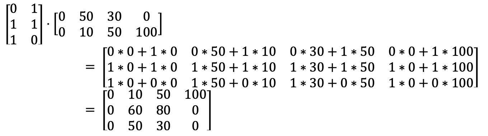
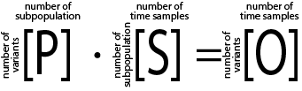

# Subpopulation decomposition

Decomposition of population deep-sequencing data into subpopulations using Mixed Integer Programming algorithm.

## Motivation

As results of deep sequencing of samples from bacterial experimental evolution runs (usually with antibiotics stress) we observe variants frequencies fluctuations in range 0-100%. The big problem that it is not feasible to phase these variants from short-read Illumina sequencing as selection not allowing a lot of mutations and distance between variants exceed fragment length. However we observed that "naked eye" approach to phase mutations by subpopulations works in many cases which is confirmed by subsequent clonal sequencing. The idea of current algorithm is to make some estimation of population structure that could be used for the further analyses.

## Algorithm

In evolution experiments we usually produce time series of variant frequencies changes. Let's assume that we observe the following frequencies:

| ID   | Chrom      | Pos    | Ref | Alt | Time0 | Time1 | Time2 | Time3 |
| ---- | ---------- | ------ | --- | --- | ----- | ----- | ----- | ----- |
| Mut1 | CP009273.1 | 123456 | A   | T   | 0%    | 50%   | 30%   | 0%    |
| Mut2 | CP009273.1 | 574839 | G   | C   | 0%    | 60%   | 80%   | 100%  |
| Mut3 | CP009273.1 | 894759 | C   | A   | 0%    | 10%   | 50%   | 100%  |

However the population in reality could consist of 2 subpopulations SP1 and SP2:

| Subpopulation | Mut1 | Mut2 | Mut3 |
| ------------- | ---- | ---- | ---- |
| SP1           | +    | +    | -    |
| SP2           | -    | +    | +    |

The real subpopulation dynamics is:

| Subpopulation | Time0 | Time1 | Time2 | Time3 |
| ------------- | ----- | ----- | ----- | ----- |
| SP1           | 0     | 50%   | 30%   | 0%    |
| SP2           | 0     | 10%   | 50%   | 100%  |

However we can't observe these two tables and observe only their combination. E.g. Freq<sub>Mut1</sub>(Time1) = Presence<sub>Mut1</sub>(SP1) * Freq<sub>SP1</sub>(Time1) + Presence<sub>Mut1</sub>(SP2) * Freq<sub>SP2</sub>(Time1) = 1 * 50% + 1 * 10% = 60%

In general it meant that we could think of **O**bserved frequencies as a result of matrix dot product of **P**resence and **S**ubpopulation Frequencies matrices:



Or generalized:



Where: <br>
**P** - binary matrix where elements could be 0 or 1. Represent presence (element value p<sub>i,j</sub> = 1) of variant *i* in subpopulation *j*<br>
**S** - matrix where element s<sub>i,j</sub> represent frequency of subpopulation *i* in sample *j*.<br>
**O** - matrix of observed variant frequences. Element o<sub>i,j</sub> represent frequency of variant *i* in sample *j*.

Elements of matrixes **S** and **O** could be any real number, but should be in the biologically meaningful interval [0; 1] (from 0% to 100%). The additional constrains are:

1. The sum of subpopulation frequencies in any sample should be in the interval [0, 1].
2. Each frequency of subpopulation should be in the interval [0, 1]


Therefore it would be good to have estimates of matrices **P** and **S**. To produce them the mixed integer programming (MIP) optimization was used.

### The algorithm:

We don't have any cost function as we have no generalized preference about best form of **P** and **S** matrices. Therefore we look for any solution that will satisfy problem constrains.

The MIP is a method to solve linear optimization problems. However here we have quadratic problem as we need to solve equation:
```
s = random_int(1:expected_number_of_subpopulations)

for v in 1:number_of_variants:
    for m in 1:number_of_time_samplesL:
        add_constraint(P[v, s]*S[s,m] = O[v,m])
```

As **P** is a binary matrix we can linearize this problem using an additional variable *z* (big M method):
```
for m in 1:number_of_time_samples:
    for v in 1:number of number_of_variants:
        for s in 1:expected_number_of_subpopulations
            z[v][s][m] <= p[v][s]
            z[v][s][m] >= s[s][m] + p[v][s] - 1
            z[v][s][m] >= 0
            z[v][s][m] <= s[s][m]
```

The wild type subpopulation (with presence of all variants as 0) is added as the frequency needed to have 100% sum of subpopulation frequencies.

After solving a problem frequencies of the identical subpopulations (with the same variants) are collapsed into one subpopulation with frequency equal of sum of duplicates.

Additionally algorithm tries to reconstruct parental relations between subpopulations which is useful for Muller plots. The parental information is reconstructed the following way:

1. Two vectors with presence of variants in subpopulations are substracted one from other (**Sub1** - **Sub2**).
2. If in the result vector maximum of any element is 0 then **Sub2** has all variants present in **Sub1** and **Sub1** is parent of **Sub2**.
3. However we need the most recent parent. We calculate distance between **Sub1** and **Sub2** as sum of absolute values of difference between element-wise subtraction `sum(abs(Sub1 - Sub2))`.
4. For **Sub2** we choose **Sub1** that have 0 maximum and minimal distance.

## Usage

Currently the program is configured to use GUROBI solver that is free for academic use. The default PuLP solver (CBC) was fount to be very slow and sometimes break on large data.

```
usage: decompose.py [-h] [-t VAR_TABLE] [-p] [-o OUT_DIR] [--timelimit TIMELIMIT]

Performs observed variant frequency matrix decomposition into variant presence binary matrix and subpopulation frequency matrces using mixed integer programming.

optional arguments:
  -h, --help            show this help message and exit
  -t VAR_TABLE, --var_table VAR_TABLE
                        Variant table. Columns: Chrom, Pos, Ref, Alt and sample columns.
  -p, --perc2prop       If frequencies are in percents bring them to
                        proportions. Default: False
  -o OUT_DIR, --out_dir OUT_DIR
                        Output directory. Default: output
  --timelimit TIMELIMIT
                        Time limit for solving the problem. Default: 180
```

### Input

The only mandatory input is a variant table. The table should contain columns:

1. "Chrom"
2. "Pos"
3. "Ref"
4. "Alt"
5. All other columns are considered as samples. The values (frequencies of observed variants) should be proportions [0, 1] or percents [0, 100] **without** a "%" sign. In the case of providing percents the `--perc2prop` option should be used.

### Output

The output directory contains the following files:

- freq_sub.tsv - Resulted **S** matrix *__before__* collapsing identical subpopulations.
- freq_sub_collapsed.tsv - Resulted **S** matrix *__after__* collapsing identical subpopulations.
- presence_sub.tsv - Resulted **P** matrix *__before__* collapsing identical subpopulations.
- presence_sub_collapsed.tsv - Resulted **P** matrix *__after__* collapsing identical subpopulations.
- reconstructed.tsv - Resulted reconstructed **O'** matrix *__before__* collapsing identical subpopulations. **O'** = **P** * **S**.
- reconstructed_collapsed.tsv - Resulted reconstructed **O'** matrix *__after__* collapsing identical subpopulations. **O'** = **P** * **S**.
- parent_collapsed.tsv - Reconstruction of most likely parent-offspring relationship between subpopulations.
